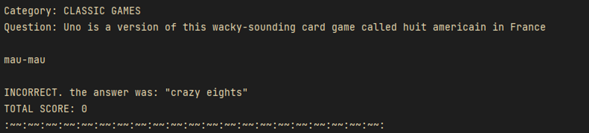
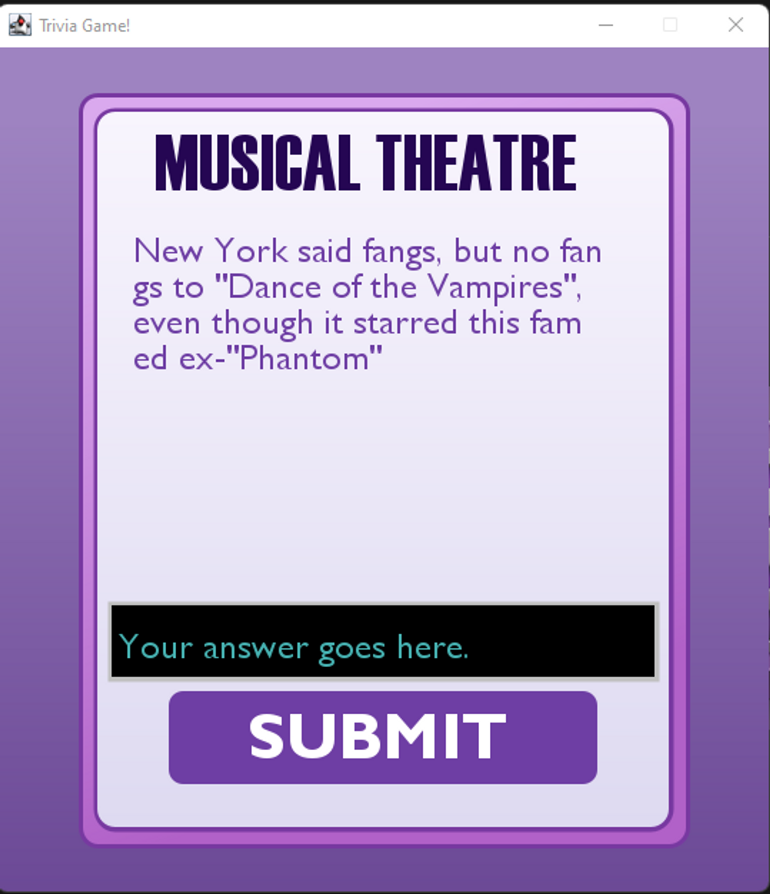

# kenzie-capstone-quiz

Test your skills by answering 10 trivia questions in this small yet entertaining game.  After answering all ten questions, receive your score see how well you performed!

There are 355,237 questions, and 40,950 categories in total, and you don’t get the same question twice.

### Features

- [x] Responds to user input.
- [x] REST api usage
- [x] Connects to the web.
- [x] Reads JSON files with [Jackson](https://github.com/FasterXML/jackson/wiki/FAQ).
- [x] GUI using Java Swing.

 

## What is it?

It’s a free to play Java game that I made for my final project as a Kenzie Academy student.

Yes, free! You also have permission to play around with the code if you like. 

### Rest Api

This game utilizes HTTP connections so that the large amount of information from the  [JService API](https://jservice.kenzie.academy/) isn’t downloaded to your computer. By connecting to the web address, the program receives a JSON file, which is interpreted with the Jackson library to make this file type useful. The API used in this application is a database for a plethora of trivia questions and the answers to them.

Since it connects to the web in order to work, please make sure you are connected to the internet before playing the game!

### Java Swing

Currently working on an implementation of a Graphical User Interface ( GUI ) version of the game. If you wish to view my beta/demo for the planning of the GUI, go ahead and start the main in program 2. 

Unfortunately, version 2 of this program does not have a working game loop. You cannot properly play the game in the GUI version yet. If you wish to play the game, you may do so in version 1 through the console.

## Getting started

There are two versions for this program. In summary, version 1 is a complete game. Version 2 is an unfinished GUI version of the game that is view-only. 

### Version 1

    

- [x]  Runs in the console.
- [x]  Fully functioning game logic.
- [x]  Answer 10 questions, you will be granted a total score at the end of the game.
- [x]  Somewhat lenient with spelling errors. “SKATEBOARD” counts for answer “a skateboard”
- [ ]  No GUI.

### Version 2

    

- [ ]  Does not contain game logic.
- [ ]  Incomplete.
- [x]  Uses Java Swing for the GUI.
- [x]  Contains an editable text box that listens for the user’s keyboard input.

The GUI version is incomplete and does not allow the user to play the game in full. You'll have to use the console version if you actually want to play the game. However, I was still able to implement the usage of the JService API to display a question and a genre.

## Installation

This java program was made with the amazon Corretto 16 version of java. ZIP downloads will be available soon.

Currently to run these programs it is best to close the repository onto your computer by using git, and then opening the project in a program such as IntelliJ or Eclipse. At some point I will create ZIP files for this project that include the .exe and/or jar files for easier usage. [Guide on how to clone a repository.](https://docs.github.com/en/repositories/creating-and-managing-repositories/cloning-a-repository) This program uses java [amazon corretto 16](https://docs.aws.amazon.com/corretto/latest/corretto-16-ug/downloads-list.html), make sure you have java downloaded on your computer. You can install this version of java through a program like [IntelliJ](https://www.jetbrains.com/idea/) which has a built in function to download java JDKs. If you need assistance, refer to my contacts at the bottom of this README!

Do not worry, a jar & exe  file for both versions of the application will be released soon, when I have the time.

### Prerequisites

- Java must be installed on your computer.
- [Amazon Corretto 16](https://docs.aws.amazon.com/corretto/latest/corretto-16-ug/downloads-list.html)
    - alternatively, use [IntelliJ](https://www.jetbrains.com/idea/).

## Collaborations

You may use anything in this code for your own purposes, and copy any bit of code for your own projects. This code as a whole has been created by me, and you should not claim it as your own. If you wish to add contributions, contact me through discord or send me an email. You can feel free to use any part of the code in any way that you like, just do not claim the code as your own. 

Email: its.sagebelknap@gmail

Discord: XyzzY🛸#4675

Discord ID: 410254652391555123
